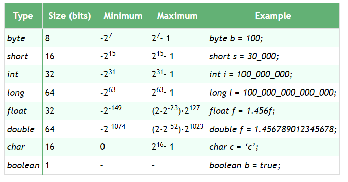

# Java Basics Notes
- Object Oriented
- Statically Typed
- Strongly Typed
- Write Once, Run Anywhere
  - Java Development Kit (JDK)
    - Java Runtime Environment (JRE)
      - Java Virtual Machine (JVM)
- Automatic Memory Management
- Rich Open Source Community

# Primitives

image taken from [this](https://www.baeldung.com/java-primitives#:~:text=The%20primitive%20data%20types%20have%20size%20limits.%20But%20what%20happens) article

# Class Vs Object
- Classes are your code blueprints
- Objects are your blueprint implementations
- See Person class for more details